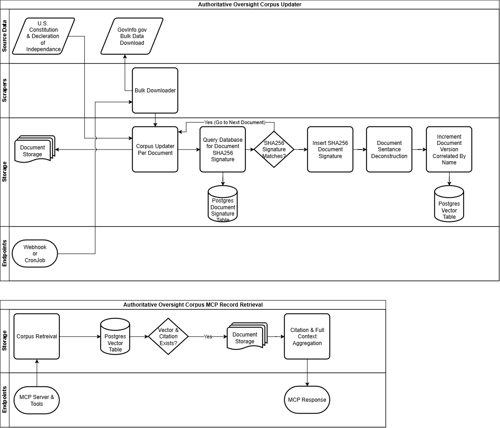

# Authoritative Oversight Corpus & MCP

## Project Purpose

This project provides a training platform for law enforcement officers and the
public, built on a corpus of authoritative legal source material — the U.S.
Constitution, the Declaration of Independence, and statutory and case law
pulled from GovInfo.gov.

The corpus itself is retrieval-only: it surfaces primary-source citations
(constitutional text, statutes, case law) in response to a query. It does not
interpret the law or apply it to a specific real-world situation. Training
content — scenario-based questions, video, imagery, and eventually
simulation — is built on top of the corpus and grounded in real citations,
but is framed as hypothetical and educational rather than as live guidance
for an actual encounter. This distinction is intentional: it keeps the
project in "legal reference and education" territory rather than "legal
advice," which carries meaningfully different regulatory exposure.

Two audiences are served by the same underlying corpus:

- **Officer training** — scenario-based curriculum tied to real constitutional
  and case-law citations, positioned as a lighter-weight complement to
  existing use-of-force and de-escalation simulation platforms, not a
  replacement for them.
- **Public education** — a "know your rights" layer aimed at civilian
  understanding of constitutional protections, sourced from the same
  authoritative corpus.

## Architectural Design

### Diagram overview

**Corpus Updater**

- The Bulk Downloader pulls source documents from GovInfo.gov, alongside the
  static founding documents (U.S. Constitution and Declaration of
  Independence).
- The Corpus Updater processes documents one at a time. For each document, it
  queries the Signature Table for that document's current stored SHA256
  signature and compares it against a freshly computed hash of the
  newly-downloaded content.
  - **Match** — the document is unchanged. No reprocessing occurs; the
    updater moves on to the next document.
  - **Mismatch** — the document is new or has changed since the last run.
    The updater increments the document's version number, deconstructs the
    document into sentences, and writes new vector rows tagged with that
    version. Only after this reprocessing succeeds is a new row written to
    the Signature Table. Signature writes are deliberately ordered last so
    that a document is never marked "current" until its corresponding
    vectors have actually been persisted — avoiding a state where the
    system believes a document is up to date while holding stale or
    missing content for it.
- Prior versions are retained rather than overwritten (a slowly changing
  dimension approach), so the corpus can answer not just "what does the law
  say now" but, in principle, "what did it say as of a given version."
- A Webhook or CronJob triggers updater runs on a schedule or in response to
  an external event.

**MCP Record Retrieval**

- MCP Server & Tools receives a query from an MCP client and passes it to
  Corpus Retrieval.
- Corpus Retrieval performs a search against the Vector Table, scoped to
  current-version rows by default.
- If a matching vector and its citation exist, the system retrieves the
  surrounding sentence context from Document Storage — walking to
  neighboring sentences rather than returning an isolated fragment, since
  a single sentence is often not enough context for a legal citation to be
  meaningful.
- Citation & Full Context Aggregation composes the retrieved sentences
  together with their citation metadata into a single response.
- The result is returned to the caller as the MCP Response.

### Database Table Schema

Document identity, versioning, and currency are normalized into a single
`Document` table, which `Signature` and `Vector` both reference by foreign
key. This keeps "is this document version current" a single-row fact rather
than something duplicated — and potentially inconsistent — across every
signature and vector row belonging to that version.

**Document** — one row per document version

| Column | Type | Notes |
|---|---|---|
| `id` | int | Primary key |
| `name` | string | Document identifier |
| `version` | int | Incremented on each detected change |
| `location` | string | Full source path |
| `created_at` | date | |
| `is_current_version` | bool | Source of truth for currency |
| `expired_at` | date | Nullable; set when this version is superseded |

**Signature**

| Column | Type | Notes |
|---|---|---|
| `id` | int | Primary key |
| `document_id` | int | Foreign key → `Document.id` |
| `sha256_signature` | string | Hash of the source document at this version |

**Vector**

| Column | Type | Notes |
|---|---|---|
| `id` | int | Primary key |
| `document_id` | int | Foreign key → `Document.id` |
| `vector` | vector | Embedding for this sentence |
| `sentence_num` | int | Position of this sentence within the document |
| `sentence` | string | The sentence's source text |

Storing `sentence` text directly on the Vector row is a deliberate
denormalization: it lets retrieval return matched text (and its
neighboring range, via `sentence_num`) straight from a single indexed
query, without a separate read against raw Document Storage on every
request. The raw document remains archived in Document Storage
independently — this is a read-performance duplication, not the only copy
of the text.

**Database Indexes**

- `Document(name, is_current_version)` — locating the current version of a
  document, used by both the signature-check step in the updater and the
  default scoping of retrieval queries.
- `Vector(document_id, sentence_num)` — the neighbor-range lookup behind
  Citation & Full Context Aggregation.
